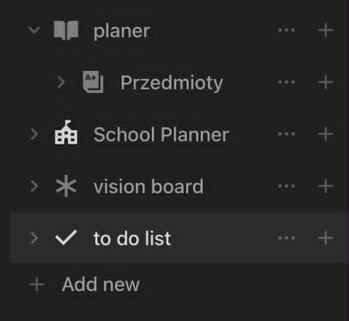

# Podstawowe funkcje

Dzięki Notion można w łatwy sposób tworzyć nowe foldery, które ułatwiają organizację informacji, zadań, projektów i współpracy zespołowej. Pozwala na dostosowanie struktóry danych do własnych preferencji.

Użytkownik może samodzielnie tworzyć własne podstrony i kategorie dostosowane do swoich potrzeb. Przykłady takich folderów to

# Tworzenie stron i notatek

- Możliwość tworzenie stron i podstron
- Formatowanie testu (nagłówki, listy, tabele)
- Dodawanie obrazów, plików, filmów
- Wyszukiwanie po tekście i nawigacja między stronami
  
# Organizacja zadań i projektów
- Listy zadań z checkboxami
- Harmonogramy i kalendarze
- Przypisanie zadań członkom zespołu

# Bazy danych
- Tworzenie własnych baz danych
- Tabele, listy, kalendarze
- Filtry (sortowanie i grupowanie)
- Tworzenie relacji

# Praca zespołowa
- Udostępnianie stron wybranym współpracownikom
- Wspólna edycja
- Dodawanie komentarzy
- Historia zmian
