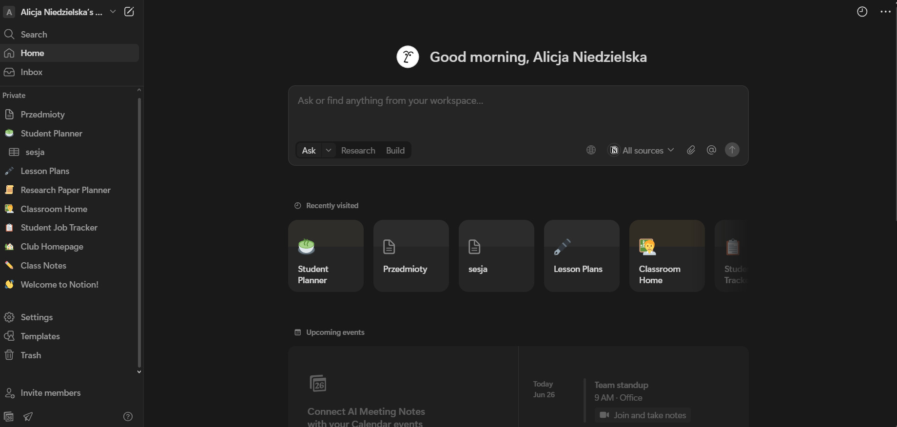

# Konfiguracja Notion

Konfiguracja Notion jest prosta i intuicyjna co pozwala szybko zacząć pracę.

# Rejestracja i logowanie
- Możliwość założenia konta przez konto google czy e-mail
- Logowanie z przeglądarki lub aplikacji

# Ustawienia podstawowe
- Zmiena motywu (ciemny/jasny)
- Ustawienia języka i strefy czasowej
- Edycja profilu i zdjęcia
- Powiadomienia e-mail

# Organizacja pracy
- Tworzenie prywatnych i zespołowych prac
- Zapraszanie członków do zespołu
- Role w zespole: Administrator, Członek, Gość
- Zarządzanie uprawnieniami

# Aplikacja
Motion działa w przeglądarce ale dostępna jest również aplikacja.

- Mobilna: Android i ios (Google play i App Store)
- Desktop: Windows, macOS

  
  
