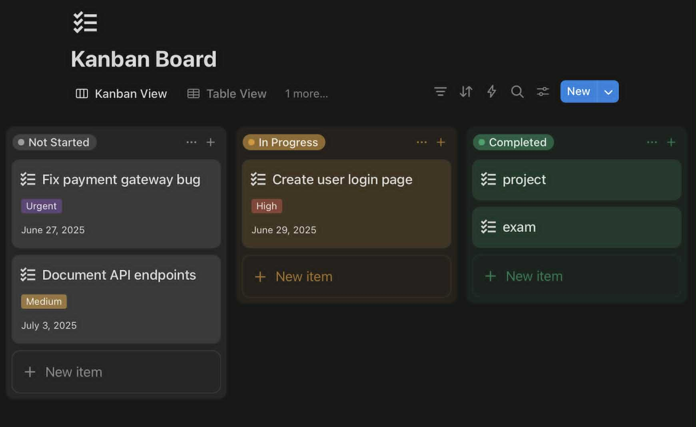
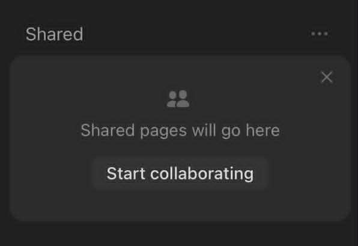
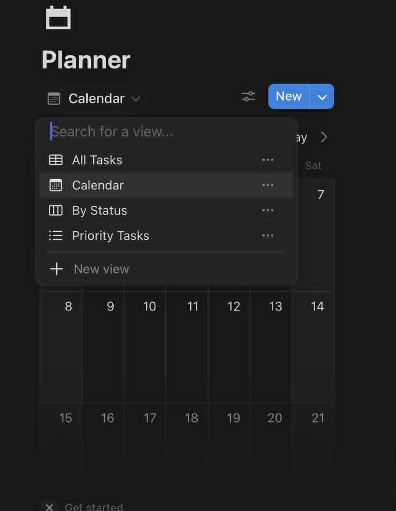
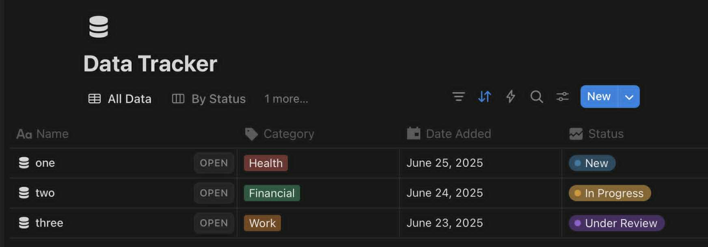

# Przykłady zastosowania Notion

??? info "Zarządzanie zadaniami (Kanban / To-Do)"

    Notion umożliwia tworzenie tablic typu *Kanban*, które pozwalają organizować zadania w kolumnach:

    - Do zrobienia  
    - W trakcie  
    - Zakończone  

    Taki sposób pracy pozwala na szybkie śledzenie postępów zadań, ustalanie priorytetów i przypisywanie osób.

    
---

??? info "Wspólne notatki zespołowe"

    Notion świetnie sprawdza się jako narzędzie do tworzenia wspólnych notatek i dokumentów.  
    Dzięki edycji w czasie rzeczywistym kilka osób może pracować równocześnie na tej samej stronie — np. podczas spotkań, burzy mózgów, planowania projektu czy tworzenia dokumentacji.

    Notatki można formatować za pomocą:
    
    - nagłówków i list,
    - checkboxów,
    - linków i załączników.

    To sprawia, że Notion może pełnić funkcję wygodnego zamiennika dla klasycznych edytorów tekstu.

    

---

??? info "Planer nauki i organizacja szkoły"

    Notion jest bardzo popularne wśród uczniów i studentów, ponieważ pozwala stworzyć *spersonalizowany planner edukacyjny*.  
    Taki system może zawierać:

    - kalendarz semestralny,
    - listę przedmiotów i terminów,
    - plan nauki do egzaminów,
    - zadania do wykonania w tygodniu.

    Użytkownik może dostosować wygląd, dodać kolory, ikony, statusy czy tagi.  
    Wszystko w jednym miejscu — łatwe do zarządzania i edytowania.

    

---
??? info "Baza wiedzy i dokumentacja"

    Notion idealnie nadaje się do tworzenia zespołowych baz wiedzy, tzw. wiki.  
    Dzięki systemowi podstron można logicznie zorganizować:

    - procedury i instrukcje,
    - odpowiedzi na najczęstsze pytania (FAQ),
    - dokumentację techniczną,
    - dane kontaktowe i ważne linki.

    Takie rozwiązanie pozwala członkom zespołu szybko odnaleźć potrzebne informacje, nawet jeśli nie byli zaangażowani wcześniej.

    